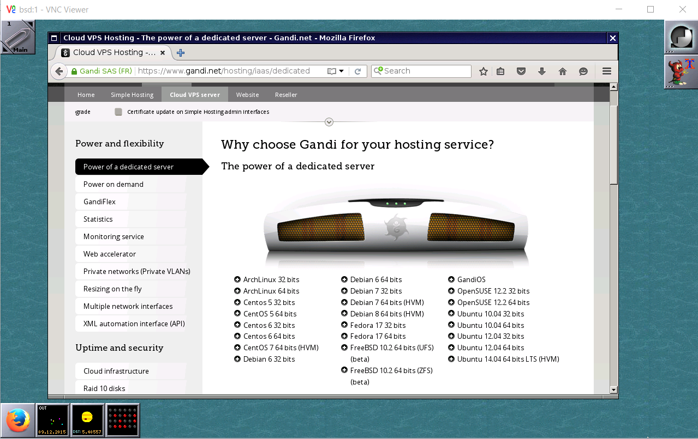

DRAFT!

Installing a X-Server with WindowMaker and x11vnc on Gandi's hosting
====================================================================



Howto install FreeBSD on a Gandi VPS together with X11 and x11vnc to act as your virtual (graphical) terminal.

Window Maker is an X11 window manager [add background] http://windowmaker.org/FAQ.php

1. Build the VM using Gandi CLI

You can do this also on the web interface at https://www.gandi.net/ but I recommend to set up Gandi CLI together with your SSH keys as explained under http://cli.gandi.net/

We build a VM with 4 cores, 2048, hostname bsd, with FreeBSD 10.2 (ZFS) and IPv4 support at Gandi's datacenter in Luxembourg:
```
$ gandi vm create --cores 4 --memory 2048 --hostname bsd2 --image 'FreeBSD 10.2 64 bits (ZFS) (beta)' --datacenter LU-BI1 --ip-version 4 --size 10G
```

Output:
```
* root user will be created.
* SSH key authorization will be used.
* No password supplied for vm (required to enable emergency web console access).
* Configuration used: 4 cores, 2048Mb memory, ip v4+v6, image FreeBSD 10.2 64 bits (ZFS) (beta), hostname: bsd, datacenter: LU-BI1
Creating your Virtual Machine bsd.
Progress: [##############################################################################################] 100.00%  00:01:17
Your Virtual Machine bsd2 has been created.
```

Once the machine is online (be a bit patient) and if our keys were configured correctly we can ssh into it with:
$ gandi vm ssh bsd

When you enter "df -h" you'll notice that we only have 1.5GB available.
We can configure different partitions now or we can just expand the pool of the first partition with:
$ zpool online -e gandiroot da0

Now we have enough space for the X-Server and some other programs. First, lets upgrade 'pkg' which is the package manager of FreeBSD.
See also https://www.freebsd.org/doc/handbook/pkgng-intro.html

$ pkg upgrade

Simply confirm all questions there with 'y' about downloading the related packages.
We now fetch, extract and install some of the FreeBSD Ports ( see https://www.freebsd.org/ports/ and https://www.freebsd.org/doc/handbook/ports-using.html ) needed for the X-Server using the portsnap tool.
This should take around 10 minutes.

$ portsnap fetch ; portsnap extract; portsnap update

After having the Ports in place we install screen first ( https://www.gnu.org/software/screen/ ) which allows us to run a interactive shells in multiple windows (and detach them), so in case our network connection breaks down we can simply run "screen -r" to get the terminal back.
You'll see a couple of dialogs asking configuration specific questions (simply hit the Enter key). Setting the environment variable BATCH=yes will disable these interactive prompts.

$ cd /usr/ports/sysutils/screen
$ make install
$ screen

Now its time to build all packages for X11. You can also install FreeBSD packages but its more fun to customize things (and one of the things working well under FreeBSD).
We start with the virtual X11-server (xvfb).
This will take around 15 minutes as there are many package dependencies and we run it as batch command (no interactive prompts).

$ cd /usr/ports/x11-servers/xorg-vfbserver
$ env BATCH=y make install

Xvfb requires xkeyboard-config (not sure how to run it without it) so we also need to build that one.

$ cd /usr/ports/x11/xkeyboard-config
$ env BATCH=y make install

At last, lets build x11vnc and also xterm

$ cd /usr/ports/net/x11vnc
$ env BATCH=y make install

$ cd /usr/ports/x11-wm/windowmaker
$ env BATCH=y make install

At this point, we could create a new user and install WindowMaker.

Lets build and install some extras (some Fonts and Firefox).

$ cd /usr/ports/x11-fonts/xorg-fonts
$ env BATCH=yes make install

$ cd /usr/ports/x11-fonts/xorg-fonts
$ env BATCH=yes make install

Generate dbus-uuid (needed to run Firefox):

$ dbus-uuidgen >/etc/machine-id

export DISPLAY=:1
Xvfb :1 -screen 0 1280x768x16 &
wmaker &
x11vnc -display :1 -bg -nopw -listen localhost -xkb -shared -forever

