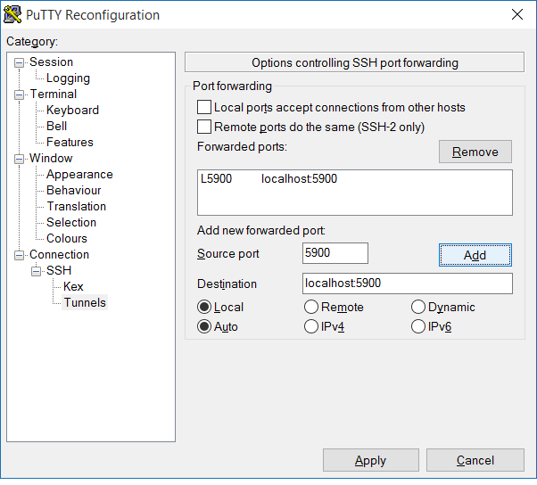
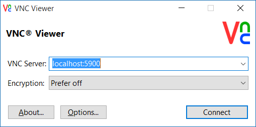

Installing a X-Server with WindowMaker and x11vnc on Gandi's hosting
====================================================================

.. image:: images/bsd-vnc.png

How to install FreeBSD on a Gandi VPS together with X11 and x11vnc to act as your virtual (graphical) terminal.

Window Maker is light X11 window manager, has been around since 1997 and is still in active development. Its a perfect Window Manager for a "remote desktop".  More information about Window Maker: http://windowmaker.org/FAQ.php
This document will explain you step by step how to to setup a VM, install X11, Window Maker, Firefox and how to access them remotely over VNC.

Starting a FreeBSD VM using Gandi CLI
---------------------------------------

Note: You can do this also on the web interface at https://www.gandi.net/ but I recommend to set up any VM using Gandi CLI (together with your API and SSH keys) as explained under http://cli.gandi.net/

We build a VM with 4 cores, 2048, hostname bsd, with FreeBSD 10.2 (ZFS) and IPv4 support at Gandi's datacenter in Luxembourg:

    ::
    
        $ gandi vm create --cores 4 --memory 2048 --hostname bsd2 --image 'FreeBSD 10.2 64 bits (ZFS) (beta)' --datacenter LU-BI1 --ip-version 4 --size 10G

Output:

    ::
    
        * root user will be created.
        * SSH key authorization will be used.
        * No password supplied for vm (required to enable emergency web console access).
        * Configuration used: 4 cores, 2048Mb memory, ip v4+v6, image FreeBSD 10.2 64 bits (ZFS) (beta), hostname: bsd, datacenter: LU-BI1
        Creating your Virtual Machine bsd.
        Progress: [##############################################################################################] 100.00%  00:01:17
        Your Virtual Machine bsd2 has been created.

Once the machine is online (be a bit patient) and if our keys were configured correctly we can ssh into it with:
    ::
    
        $ gandi vm ssh bsd

When you enter "df -h" you'll notice that we only have 1.5GB of space available.
We can configure different partitions now or we can just expand the pool of the first partition. To use the entire root partition (minus swap) simply run the zpool command as following:

    ::
    
        $ zpool online -e gandiroot da0

Now we have enough space for the X-Server and some other programs. First, lets upgrade 'pkg' which is the package manager of FreeBSD.
See also https://www.freebsd.org/doc/handbook/pkgng-intro.html

        ::
    
        $ pkg upgrade

Simply confirm all questions there with 'y' about downloading the related packages.
We now fetch, extract and install some of the FreeBSD Ports ( see https://www.freebsd.org/ports/ and https://www.freebsd.org/doc/handbook/ports-using.html ) needed for the X-Server using the portsnap tool.
This should take around 10 minutes.

    ::

        $ portsnap fetch ; portsnap extract; portsnap update

After having the Ports in place we install screen first ( https://www.gnu.org/software/screen/ ) which allows us to run interactive shells in multiple, virtual terminal windows andin case our network connection breaks down we can simply run "screen -r" to get the terminal back.
You'll see a couple of dialogs asking configuration specific questions (simply hit the Enter key). Setting the environment variable BATCH=yes will disable these interactive prompts.

    ::

        $ cd /usr/ports/sysutils/screen
        $ make install
        $ screen

Now its time to build all packages for X11. You can also install binary (precompiled) FreeBSD packages but its more fun to customize things (and one of the things which work very well under FreeBSD).
We start by building and installing the virtual X11-server (xvfb), xkeyboard-config and Window Maker.
This will take around 15 minutes. As there are many package dependencies we run this as batch command (no interactive prompts).

    ::
    
        $ cd /usr/ports/x11-servers/xorg-vfbserver
        $ env BATCH=y make install
        $ cd /usr/ports/x11/xkeyboard-config
        $ env BATCH=y make install
        $ cd /usr/ports/x11-wm/windowmaker
        $ env BATCH=y make install

You can always rebuild these apps with whatever patches you may have in mind.

Now lets build and install the VNC server.

    ::

        $ cd /usr/ports/net/x11vnc
        $ env BATCH=y make install

And some extras (some Fonts, Firefox, xterm).
It might be better not to run the Firefox installation in batch mode (there's a lot to customize).

    ::
    

        $ cd /usr/ports/x11-fonts/xorg-fonts
        $ env BATCH=yes make install
        $ cd /usr/ports/www/firefox
        $ env BATCH=yes make install
        $ cd /usr/ports/x11/xterm
        $ env BATCH=yes make install

Running the VNC server
----------------------

We use setenv DISPLAY :1 to specify ":!" as the X11 display where any app should connect.
Our virtual framebuffer will run there. We launch Window Maker (which will automatically install itself).
Note that it is not necessary to run these commands as root (you may create a new, non-priviledged user).
We then start x11vnc with our desired resolution. You can start xterm and Firefox here as well (& will fork the process into the background).

    ::
    
        setenv DISPLAY :1
        Xvfb :1 -screen 0 1280x768x16 &
        wmaker &
        x11vnc -display :1 -bg -nopw -listen localhost -xkb -shared -forever
        firefox &
        xterm &

We see this message:

    ::
    
        The VNC desktop is:      localhost:0
        PORT=5900

Connecting to the X11 server (Putty)
------------------------------------

If you use Putty (a Windows SSH client) simply set up a port forwarding while you are connected to your machine via SSH.

Install a VNC client (for example https://www.realvnc.com/download/viewer/ ) and simply connect to localhost:5900

You can use this environment to test new apps or patch existing software.
If they are Open Source you should also share your changes on Github!
